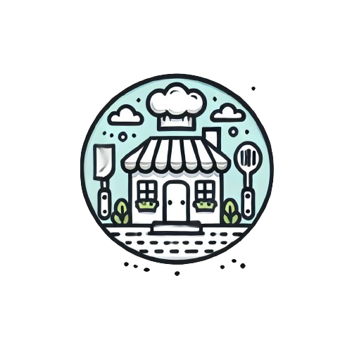

<a name="readme-top"></a>

<!-- PROJECT LOGO -->
<br />
<div align="center">
  <a href="https://github.com/vicentelo0227/C3-Keywork-1">
    
  </a>
<h3 align="center">Favorite Restaurant List</h3>
</div>

<!-- TABLE OF CONTENTS -->
<details>
  <summary>Chapters</summary>
  <ol>
    <li>
      <a href="#about-the-project">About The Project</a>
      <ul>
        <li><a href="#built-with">Built With</a></li>
      </ul>
    </li>
    <li>
      <a href="#getting-started">Getting Started</a>
      <ul>
        <li><a href="#prerequisites">Prerequisites</a></li>
        <li><a href="#installation">Installation</a></li>
      </ul>
    </li>
    <li><a href="#usage">Usage</a></li>
    <li><a href="#contributing">Contributing</a></li>
    <li><a href="#license">License</a></li>
    <li><a href="#contact">Contact</a></li>
    <li><a href="#acknowledgments">Acknowledgments</a></li>
  </ol>
</details>


<!-- ABOUT THE PROJECT -->
## About The Project

This is a pocket list of favorite restaurants, containing a total of eight. Users can click on each restaurant to view details or search by keywords to find their desired restaurant.

<p align="right">(<a href="#readme-top">back to top</a>)</p>


### Built With

* Node.js -- v20.15.0
* Express.js -- v4.19.2
* Nodemon
* handlebars.js -- v7.1.3

<p align="right">(<a href="#readme-top">back to top</a>)</p>


<!-- GETTING STARTED -->
## Getting Started

Below are some steps of how you set up project locally.
To get a local copy up and running follow these simple example steps.

### Prerequisites

Install Node.js
* [Node.js](https://nodejs.org/)
  ```sh
  curl -o- https://raw.githubusercontent.com/nvm-sh/nvm/v0.39.7/install.sh | bash

  nvm install 20 # use v20

  node -v # should print `v20.15.0`
  ```

Install Express.js
* [Express.js](https://expressjs.com/)
  ```sh
  npm install express
  ```

Install Nodemon
* [Nodemon](https://www.npmjs.com/package/nodemon)
  ```sh
  npm install -g nodemon
  ```

Install Express-handlebar
* [Express-handlebar](https://www.npmjs.com/package/express-handlebars)
  ```sh
  npm install express-handler
  ```


### Installation

1. Clone the repo
   ```sh
   git clone https://github.com/vicentelo0227/C3-Keywork-1.git
   ```
   
2. Check NPM packages
   ```sh
   npm -v
   ```

<p align="right">(<a href="#readme-top">back to top</a>)</p>


<!-- USAGE -->
## Usage

* search keyword through search bar
* click each restaurant and see its detail


<p align="right">(<a href="#readme-top">back to top</a>)</p>


